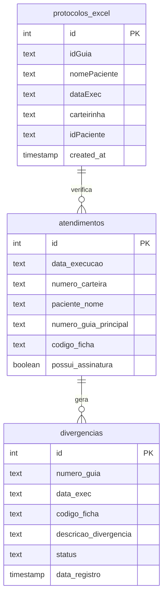

# Estrutura do Banco de Dados

## Diagrama de Relacionamento

## Descrição das Tabelas

### protocolos_excel
Armazena os dados importados de planilhas Excel, servindo como fonte de referência para verificação dos atendimentos.

### atendimentos
Registra os atendimentos realizados, com informações do beneficiário, guia e código da ficha.

### divergencias
Registra inconsistências encontradas entre os protocolos do Excel e os atendimentos registrados.

## Observações
- Não existem chaves estrangeiras explícitas (FOREIGN KEYS) no esquema atual
- O relacionamento entre as tabelas é feito através de campos de texto como `numero_guia`, `codigo_ficha`
- A auditoria é feita cruzando dados entre `protocolos_excel` e `atendimentos`, gerando registros em `divergencias`
- Os campos de data são armazenados como TEXT, não como DATE/TIMESTAMP
- Existe um sistema de status para acompanhamento das divergências (default 'Pendente')