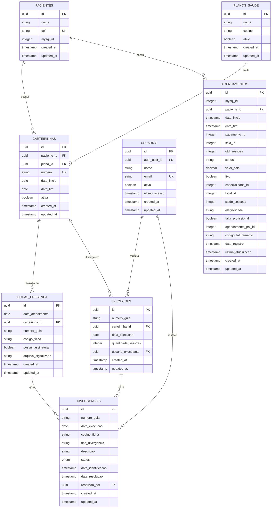

# Sistema de Auditoria de Atendimentos

## 1. Visão Geral do Sistema

O sistema foi desenvolvido para automatizar e controlar o processo de auditoria de atendimentos médicos, focando na validação entre fichas físicas assinadas e execuções registradas no sistema da Unimed. O objetivo principal é garantir que todos os atendimentos realizados estejam corretamente documentados e faturados.

## 2. Fluxo do Processo

### 2.1 Atendimento Inicial
1. Paciente comparece ao atendimento
2. Assina a ficha de presença física
3. A recepção digitaliza a ficha assinada
4. O arquivo digitalizado é armazenado no sistema

### 2.2 Faturamento
1. Faturista acessa o sistema da Unimed
2. Registra a execução do atendimento manualmente
3. Sistema interno registra a execução realizada
4. Sistema verifica automaticamente por divergências

### 2.3 Auditoria
1. Sistema compara automaticamente:
   - Quantidade de fichas digitalizadas vs execuções registradas
   - Presença de assinaturas nas fichas
   - Datas e quantidades correspondentes
2. Divergências são registradas automaticamente
3. Auditores podem visualizar e resolver as divergências
4. Sistema mantém histórico de todas as resoluções

## 3. Estrutura do Banco de Dados

### 3.1 Tabelas Principais

#### `fichas_presenca` (Fichas Digitalizadas)
```sql
CREATE TABLE fichas_presenca (
    id UUID PRIMARY KEY,
    data_atendimento DATE,
    paciente_carteirinha TEXT,
    paciente_nome TEXT,
    numero_guia TEXT,
    codigo_ficha TEXT UNIQUE,
    possui_assinatura BOOLEAN,
    arquivo_digitalizado TEXT
);
```
- Armazena as fichas físicas digitalizadas
- Registra informações da ficha de presença
- Controla presença de assinaturas
- `codigo_ficha`: Identificador único da ficha de presença

#### `execucoes` (Execuções no Sistema Unimed)
```sql
CREATE TABLE execucoes (
    id UUID PRIMARY KEY,
    numero_guia TEXT,
    paciente_nome TEXT,
    data_execucao DATE,
    paciente_carteirinha TEXT,
    paciente_id TEXT,
    quantidade_sessoes INTEGER,
    usuario_executante UUID,
    codigo_ficha TEXT REFERENCES fichas_presenca(codigo_ficha)
);
```
- Registra execuções feitas no sistema da Unimed
- `paciente_carteirinha`: Número da carteira do plano de saúde do paciente
- `paciente_id`: Identificador do paciente no sistema (texto)
- `codigo_ficha`: Chave estrangeira que relaciona a execução com uma ficha de presença
- Controla quantidade de sessões executadas
- Rastreia usuário responsável pela execução

#### `divergencias` (Inconsistências Encontradas)
```sql
CREATE TABLE divergencias (
    id UUID PRIMARY KEY,
    numero_guia TEXT,
    data_execucao DATE,
    codigo_ficha TEXT,
    tipo_divergencia TEXT,
    descricao TEXT,
    status status_divergencia,
    data_resolucao TIMESTAMPTZ,
    resolvido_por UUID
);
```
- Registra divergências identificadas
- Controla status de resolução
- Mantém histórico de resoluções

#### `planos_saude` (Planos de Saúde)
```sql
CREATE TABLE planos_saude (
    id UUID PRIMARY KEY,
    nome TEXT NOT NULL,
    codigo TEXT,
    ativo BOOLEAN DEFAULT true,
    created_at TIMESTAMPTZ DEFAULT NOW(),
    updated_at TIMESTAMPTZ DEFAULT NOW()
);
```
- Armazena informações sobre os planos de saúde
- Controla status de ativação do plano
- Rastreia datas de criação e atualização

#### `carteirinhas` (Carteirinhas dos Pacientes)
```sql
CREATE TABLE carteirinhas (
    id UUID PRIMARY KEY,
    paciente_id UUID REFERENCES fichas_presenca(paciente_id),
    plano_saude_id UUID REFERENCES planos_saude(id),
    numero_carteirinha TEXT NOT NULL,
    data_validade DATE,
    ativo BOOLEAN DEFAULT true,
    created_at TIMESTAMPTZ DEFAULT NOW(),
    updated_at TIMESTAMPTZ DEFAULT NOW(),
    UNIQUE(paciente_id, plano_saude_id, numero_carteirinha)
);
```
- Vincula pacientes a planos de saúde
- Armazena números de carteirinha únicos por paciente/plano
- Controla validade das carteirinhas
- Permite múltiplas carteirinhas por paciente
- Mantém histórico de datas de criação e atualização

## 5. Diagrama do Banco de Dados



### 5.1 Análise das Tabelas e Relações

#### Tabela PACIENTES
- **Objetivo**: Centralizar informações dos pacientes
- **Campos Essenciais**: id, nome, cpf
- **Campos para Integração**: mysql_id (para sincronização)
- **Relações**: 
  - Um paciente pode ter várias carteirinhas
  - Um paciente pode ter vários agendamentos

#### Tabela PLANOS_SAUDE
- **Objetivo**: Cadastro de convênios aceitos
- **Campos Essenciais**: id, nome, codigo, ativo
- **Relações**: Um plano pode emitir várias carteirinhas

#### Tabela CARTEIRINHAS
- **Objetivo**: Vincular pacientes a planos de saúde
- **Campos Essenciais**: id, paciente_id, plano_id, numero, data_inicio, data_fim, ativa
- **Relações**: 
  - Pertence a um paciente
  - Pertence a um plano
  - Usada em fichas e execuções

#### Tabela FICHAS_PRESENCA
- **Objetivo**: Registrar atendimentos físicos
- **Campos Essenciais**: id, data_atendimento, carteirinha_id, numero_guia, possui_assinatura, arquivo_digitalizado
- **Relações**: 
  - Vinculada a uma carteirinha
  - Pode gerar divergências

#### Tabela EXECUCOES
- **Objetivo**: Registrar execuções no sistema Unimed
- **Campos Essenciais**: id, numero_guia, carteirinha_id, data_execucao, quantidade_sessoes, usuario_executante, codigo_ficha
- **Relações**: 
  - Vinculada a uma carteirinha
  - Registrada por um usuário
  - Pode gerar divergências

#### Tabela DIVERGENCIAS
- **Objetivo**: Controlar inconsistências entre fichas e execuções
- **Campos Essenciais**: id, numero_guia, data_execucao, tipo_divergencia, status, resolvido_por
- **Relações**: 
  - Gerada por fichas ou execuções
  - Resolvida por um usuário

#### Tabela USUARIOS
- **Objetivo**: Gerenciar usuários do sistema
- **Campos Essenciais**: id, auth_user_id, nome, email, ativo
- **Relações**: 
  - Registra execuções
  - Resolve divergências

#### Tabela AGENDAMENTOS
- **Objetivo**: Sincronizar agendamentos do sistema externo
- **Campos Essenciais**: id, mysql_id, paciente_id, data_inicio, data_fim, status, qtd_sessoes
- **Campos Opcionais**: (podem ser removidos se não utilizados)
  - pagamento_id
  - sala_id
  - valor_sala
  - especialidade_id
  - local_id
- **Relações**: 
  - Pertence a um paciente
  - Pode ser usado para validação cruzada com fichas/execuções

### 5.2 Sugestões de Otimização

1. **Campos de Auditoria**:
   - Manter created_at e updated_at em todas as tabelas
   - Adicionar campos de usuário responsável onde relevante

2. **Campos de Integração**:
   - Manter mysql_id apenas nas tabelas que precisam sincronizar (PACIENTES, AGENDAMENTOS)
   - Remover campos legados não utilizados

3. **Índices Adicionais**:
   - Criar índices compostos para buscas frequentes
   - Exemplo: (data_atendimento, numero_guia) em FICHAS_PRESENCA

4. **Validações**:
   - Adicionar constraints para garantir integridade
   - Exemplo: data_fim >= data_inicio em CARTEIRINHAS

5. **Campos Calculados**:
   - Considerar views materializadas para relatórios frequentes
   - Exemplo: total de divergências por tipo/status

## 4. Funcionalidades do Sistema

### 4.1 Registro de Fichas
- Upload de fichas digitalizadas
- Reconhecimento automático de campos (OCR opcional)
- Validação de dados básicos
- Armazenamento seguro dos arquivos

### 4.2 Controle de Execuções
- Registro de execuções no sistema Unimed
- Validação de dados do paciente
- Controle de quantidade de sessões
- Registro de usuário executante

### 4.3 Auditoria Automática
- Verificação automática de divergências
- Tipos de verificação:
  * Quantidade de fichas vs execuções
  * Presença de assinaturas
  * Datas correspondentes
  * Dados do paciente consistentes

### 4.4 Gestão de Divergências
- Interface para visualização de divergências
- Filtros e busca avançada
- Processo de resolução com histórico
- Relatórios de acompanhamento

### 4.5 Relatórios e Dashboards
- Resumo diário de execuções
- Status de divergências
- Indicadores de performance
- Exportação de dados

## 5. Segurança e Controle de Acesso

### 5.1 Autenticação
- Integração com auth.users do Supabase
- Controle de sessões
- Logs de acesso

### 5.2 Autorização
- Row Level Security (RLS) habilitado
- Políticas por tipo de usuário
- Controle granular de acesso

### 5.3 Auditoria de Ações
- Registro de todas alterações
- Histórico de resoluções
- Rastreamento de usuários

## 6. Views e Relatórios Principais

### 6.1 Divergências Pendentes
```sql
CREATE VIEW view_divergencias_pendentes AS
SELECT 
    d.*,
    f.possui_assinatura,
    f.arquivo_digitalizado,
    e.quantidade_sessoes
FROM divergencias d
LEFT JOIN fichas_presenca f 
    ON d.numero_guia = f.numero_guia 
    AND d.data_execucao = f.data_atendimento
LEFT JOIN execucoes e 
    ON d.numero_guia = e.numero_guia 
    AND d.data_execucao = e.data_execucao
WHERE d.status = 'pendente';
```

### 6.2 Resumo Diário
```sql
CREATE VIEW view_resumo_diario AS
SELECT 
    e.data_execucao,
    COUNT(DISTINCT e.numero_guia) as total_guias,
    SUM(e.quantidade_sessoes) as total_sessoes,
    COUNT(DISTINCT d.id) as total_divergencias
FROM execucoes e
LEFT JOIN divergencias d 
    ON e.numero_guia = d.numero_guia 
    AND e.data_execucao = d.data_execucao
GROUP BY e.data_execucao
ORDER BY e.data_execucao DESC;
```

## 7. Automações e Triggers

### 7.1 Verificação de Divergências
```sql
CREATE FUNCTION verificar_divergencias()
RETURNS TRIGGER AS $$
BEGIN
    -- Verifica quantidade de fichas vs execuções
    SELECT COUNT(*) INTO qtd_fichas
    FROM fichas_presenca
    WHERE numero_guia = NEW.numero_guia
    AND data_atendimento = NEW.data_execucao;

    IF qtd_fichas != NEW.quantidade_sessoes THEN
        INSERT INTO divergencias (...);
    END IF;
    RETURN NEW;
END;
$$ LANGUAGE plpgsql;
```

## 8. Interface do Usuário

### 8.1 Tela de Auditoria
- Visualização de divergências pendentes
- Filtros por:
  * Data
  * Status
  * Tipo de divergência
  * Paciente
- Ações em lote
- Exportação de dados

### 8.2 Dashboard
- Métricas principais
- Gráficos de acompanhamento
- Alertas de divergências
- Resumo de atividades

## 9. Considerações Técnicas

### 9.1 Stack Tecnológica
- Backend: Supabase (PostgreSQL)
- Frontend: Next.js 14
- UI: Shadcn/UI
- Autenticação: Supabase Auth

### 9.2 Performance
- Índices otimizados
- Views materializadas quando necessário
- Paginação eficiente
- Caching estratégico

## 10. Próximos Passos e Melhorias

### 10.1 Melhorias Planejadas
- Implementação de OCR para fichas
- Integração com APIs da Unimed (quando disponível)
- Mobile app para digitalização
- Integrações com outros sistemas

### 10.2 Escalabilidade
- Particionamento de tabelas
- Arquivamento de dados antigos
- Otimização de consultas
- Cache distribuído

## 11. Schema de Dados
erDiagram
    PACIENTES ||--o{ FICHAS_PRESENCA : "tem fichas"
    PACIENTES ||--o{ EXECUCOES : "tem execucoes"
    USUARIOS ||--o{ EXECUCOES : "registra"
    USUARIOS ||--o{ DIVERGENCIAS : "resolve"

    FICHAS_PRESENCA ||--o{ DIVERGENCIAS : "gera"
    EXECUCOES ||--o{ DIVERGENCIAS : "gera"

    PACIENTES {
        uuid id PK
        string nome
        string carteirinha UK
        timestamp created_at
        timestamp updated_at
    }

    FICHAS_PRESENCA {
        uuid id PK
        date data_atendimento
        string paciente_carteirinha FK
        string paciente_nome
        string numero_guia
        string codigo_ficha
        boolean possui_assinatura
        string arquivo_digitalizado
        timestamp created_at
        timestamp updated_at
    }

    EXECUCOES {
        uuid id PK
        string numero_guia
        string paciente_nome
        date data_execucao
        string paciente_carteirinha FK
        text paciente_id
        integer quantidade_sessoes
        uuid usuario_executante FK
        timestamp created_at
    }

    DIVERGENCIAS {
        uuid id PK
        string numero_guia
        date data_execucao
        string codigo_ficha
        string tipo_divergencia
        string descricao
        enum status
        timestamp data_identificacao
        timestamp data_resolucao
        uuid resolvido_por FK
        timestamp created_at
        timestamp updated_at
    }

    PLANOS_SAUDE {
        uuid id PK
        string nome
        string codigo
        boolean ativo
        timestamp created_at
        timestamp updated_at
    }

    CARTEIRINHAS {
        uuid id PK
        uuid paciente_id FK
        uuid plano_saude_id FK
        string numero_carteirinha
        date data_validade
        boolean ativo
        timestamp created_at
        timestamp updated_at
        UNIQUE(paciente_id, plano_saude_id, numero_carteirinha)
    }

    USUARIOS {
        uuid id PK
        uuid auth_user_id FK
        string nome
        string email UK
        boolean ativo
        timestamp ultimo_acesso
        timestamp created_at
        timestamp updated_at
    }

    AGENDAMENTOS {
        uuid id PK
        integer mysql_id
        uuid paciente_id FK
        timestamp data_inicio
        timestamp data_fim
        integer pagamento_id
        integer sala_id
        integer qtd_sessoes
        string status
        decimal valor_sala
        boolean fixo
        integer especialidade_id
        integer local_id
        integer saldo_sessoes
        string elegibilidade
        boolean falta_profissional
        integer agendamento_pai_id
        string codigo_faturamento
        timestamp data_registro
        timestamp ultima_atualizacao
        timestamp created_at
        timestamp updated_at
    }

    

## 12. Explicação dos relacionamentos

Explicação dos relacionamentos:

PACIENTES → FICHAS_PRESENCA

Um paciente pode ter várias fichas de presença
Relacionamento através da carteirinha do paciente
Cardinalidade: 1:N (um para muitos)


PACIENTES → EXECUCOES

Um paciente pode ter várias execuções no sistema Unimed
Relacionamento através da carteirinha do paciente
Cardinalidade: 1:N (um para muitos)


USUARIOS → EXECUCOES

Um usuário pode registrar várias execuções
Relacionamento através do id do usuário executante
Cardinalidade: 1:N (um para muitos)


USUARIOS → DIVERGENCIAS

Um usuário pode resolver várias divergências
Relacionamento através do id do resolvedor
Cardinalidade: 1:N (um para muitos)


FICHAS_PRESENCA/EXECUCOES → DIVERGENCIAS

Tanto fichas quanto execuções podem gerar divergências
Relacionamento através do número da guia e data
Cardinalidade: 1:N (um para muitos)

PACIENTES → CARTEIRINHAS

Um paciente pode ter várias carteirinhas
Relacionamento através do id do paciente
Cardinalidade: 1:N (um para muitos)

CARTEIRINHAS → PLANOS_SAUDE

Uma carteirinha está vinculada a um plano de saúde
Relacionamento através do id do plano de saúde
Cardinalidade: N:1 (muitos para um)

Detalhes importantes:

Chaves Primárias (PK):

Todas as tabelas usam UUID como identificador único
Garante unicidade mesmo em ambiente distribuído


Chaves Estrangeiras (FK):

Carteirinha do paciente como principal referência
IDs de usuários para rastreabilidade


Campos de Auditoria:

created_at em todas as tabelas
updated_at onde relevante
Registro de usuários responsáveis


Campos Únicos (UK):

Carteirinha do paciente
Email do usuário
Garante integridade dos dados

## 13. Fluxo atual

Frontend (Next.js):
Desenvolvimento local
Deploy no Vercel
Arquivos como page.tsx ficam no seu repositório local

Backend (FastAPI):
Hospedado no Replit
Você copia manualmente as alterações do Python local para o Replit