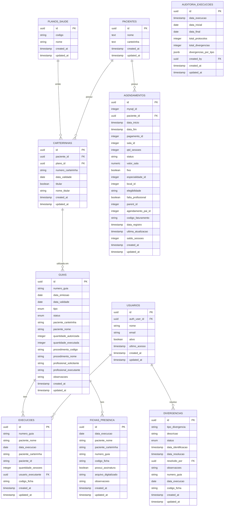

# Sistema de Auditoria de execucaos

## 1. Visão Geral do Sistema

O sistema foi desenvolvido para automatizar e controlar o processo de auditoria de execucaos médicos, focando na validação entre fichas físicas assinadas e execuções registradas no sistema da Unimed. O objetivo principal é garantir que todos os execucaos realizados estejam corretamente documentados e faturados.

## 2. Fluxo do Processo

### 2.1 execucao Inicial
1. Paciente comparece ao execucao
2. Assina a ficha de presença física
3. A recepção digitaliza a ficha assinada
4. O arquivo digitalizado é armazenado no sistema

### 2.2 Faturamento
1. Faturista acessa o sistema da Unimed
2. Registra a execução do execucao manualmente
3. Sistema interno registra a execução realizada
4. Sistema verifica automaticamente por divergências

### 2.3 Auditoria
1. Sistema compara automaticamente:
   - Quantidade de fichas digitalizadas vs execuções registradas
   - Presença de assinaturas nas fichas
   - Datas e quantidades correspondentes
2. Divergências são registradas automaticamente
3. Auditores podem visualizar e resolver as divergências
4. Sistema mantém histórico de todas as resoluções

## 3. Estrutura do Banco de Dados

### 3.1 Tabelas Principais

#### `pacientes` (Pacientes)
```sql
CREATE TABLE pacientes (
    id uuid PRIMARY KEY,
    nome text,
    carteirinha text,
    created_at timestamp with time zone,
    updated_at timestamp with time zone
);
```
- Armazena informações básicas dos pacientes
- Mantém histórico de datas de criação e atualização

#### `carteirinhas` (Carteirinhas dos Pacientes)
```sql
CREATE TABLE carteirinhas (
    id uuid PRIMARY KEY,
    paciente_id uuid,
    plano_saude_id uuid,
    numero_carteirinha character varying(50),
    data_validade date,
    titular boolean,
    nome_titular character varying(255),
    created_at timestamp with time zone,
    updated_at timestamp with time zone
);
```
- Vincula pacientes a planos de saúde
- Controla titularidade e validade das carteirinhas
- Mantém histórico de datas de criação e atualização

#### `planos_saude` (Planos de Saúde)
```sql
CREATE TABLE planos_saude (
    id uuid PRIMARY KEY,
    codigo character varying(50),
    nome character varying(255),
    created_at timestamp with time zone,
    updated_at timestamp with time zone
);
```
- Armazena informações sobre os planos de saúde
- Mantém histórico de datas de criação e atualização

#### `guias` (Guias Médicas)
```sql
CREATE TABLE guias (
    id uuid PRIMARY KEY,
    numero_guia text,
    data_emissao date,
    data_validade date,
    tipo USER-DEFINED,
    status USER-DEFINED,
    paciente_carteirinha text,
    paciente_nome text,
    quantidade_autorizada integer,
    quantidade_executada integer,
    procedimento_codigo text,
    procedimento_nome text,
    profissional_solicitante text,
    profissional_executante text,
    observacoes text,
    created_at timestamp with time zone,
    updated_at timestamp with time zone
);
```
- Armazena informações completas das guias médicas
- Controla quantidades autorizadas e executadas
- Mantém informações sobre procedimentos e profissionais

#### `fichas_presenca` (Fichas Digitalizadas)
```sql
CREATE TABLE fichas_presenca (
    id uuid PRIMARY KEY,
    data_execucao date,
    paciente_nome text,
    paciente_carteirinha text,
    numero_guia text,
    codigo_ficha text,
    possui_assinatura boolean,
    arquivo_digitalizado text,
    observacoes text,
    created_at timestamp with time zone,
    updated_at timestamp with time zone
);
```
- Armazena as fichas físicas digitalizadas
- Controla presença de assinaturas
- Permite observações sobre o execucao

#### `execucoes` (Execuções no Sistema)
```sql
CREATE TABLE execucoes (
    id uuid PRIMARY KEY,
    numero_guia text,
    paciente_nome text,
    data_execucao date,
    paciente_carteirinha text,
    paciente_id text,
    quantidade_sessoes integer,
    usuario_executante uuid,
    codigo_ficha text,
    created_at timestamp with time zone,
    updated_at timestamp with time zone
);
```
- Registra execuções feitas no sistema
- Relaciona com guias através do numero_guia
- Controla quantidade de sessões executadas

#### `divergencias` (Inconsistências Encontradas)
```sql
CREATE TABLE divergencias (
    id uuid PRIMARY KEY,
    tipo_divergencia text,
    descricao text,
    status USER-DEFINED,
    data_identificacao timestamp with time zone,
    data_resolucao timestamp with time zone,
    resolvido_por uuid,
    observacoes text,
    numero_guia text,
    data_execucao date,
    codigo_ficha text,
    created_at timestamp with time zone,
    updated_at timestamp with time zone
);
```
- Registra divergências identificadas
- Controla status e resolução
- Mantém histórico completo

#### `usuarios` (Usuários do Sistema)
```sql
CREATE TABLE usuarios (
    id uuid PRIMARY KEY,
    auth_user_id uuid,
    nome text,
    email text,
    ativo boolean,
    ultimo_acesso timestamp with time zone,
    created_at timestamp with time zone,
    updated_at timestamp with time zone
);
```
- Gerencia usuários do sistema
- Controla acesso e status

#### `agendamentos` (Agendamentos)
```sql
CREATE TABLE agendamentos (
    id uuid PRIMARY KEY,
    mysql_id integer,
    paciente_id uuid,
    data_inicio timestamp with time zone,
    data_fim timestamp with time zone,
    pagamento_id integer,
    sala_id integer,
    qtd_sessoes integer,
    status character varying(50),
    valor_sala numeric,
    fixo boolean,
    especialidade_id integer,
    local_id integer,
    elegibilidade character varying(100),
    falta_profissional boolean,
    parent_id integer,
    agendamento_pai_id integer,
    codigo_faturamento character varying(100),
    data_registro timestamp with time zone,
    ultima_atualizacao timestamp with time zone,
    saldo_sessoes integer,
    created_at timestamp with time zone,
    updated_at timestamp with time zone
);
``)
- Controla agendamentos dos pacientes
- Mantém informações sobre sessões e status
- Permite controle de faltas e faturamento

#### `auditoria_execucoes` (Metadados de Execuções de Auditoria)
```sql
CREATE TABLE auditoria_execucoes (
    id uuid PRIMARY KEY,
    data_execucao timestamp with time zone,
    data_inicial date,
    data_final date,
    total_protocolos integer,
    total_divergencias integer,
    divergencias_por_tipo jsonb,
    created_by uuid REFERENCES usuarios(id),
    created_at timestamp with time zone DEFAULT now(),
    updated_at timestamp with time zone DEFAULT now()
);
```
- Armazena metadados de cada execução de auditoria
- Registra totais e tipos de divergências encontradas
- Mantém histórico de quem executou a auditoria

## 4. Interface do Sistema

### 4.1 Gerenciamento de Pacientes

O sistema possui uma interface dedicada para o gerenciamento de pacientes, acessível através do menu lateral. Esta interface é composta por três componentes principais:

#### 4.1.1 Busca e Listagem de Pacientes
- Campo de busca para localizar pacientes
- Tabela interativa com informações básicas dos pacientes
- Botão para cadastro de novos pacientes
- Opção de edição para cada paciente listado

#### 4.1.2 Informações do Paciente
Exibe informações detalhadas do paciente selecionado em duas seções:

**Dados Pessoais:**
- Nome completo
- Número da carteirinha
- Data de cadastro no sistema

**Informações da Carteirinha:**
- Número da carteirinha
- Data de validade
- Status de titularidade (titular/dependente)
- Nome do titular (quando dependente)

#### 4.1.3 Guias do Paciente
Apresenta uma tabela com todas as guias associadas ao paciente selecionado, incluindo:
- Número da guia
- Nome do procedimento
- Data de validade
- Quantidade de sessões autorizadas
- Quantidade de sessões já utilizadas
- Saldo disponível de sessões
- Status da guia (ativa/inativa)

### 4.2 Página de Auditoria

A página de auditoria apresenta um dashboard com cards informativos mostrando:
- Total de protocolos analisados
- Total de divergências encontradas
- Data da última verificação
- Período analisado (data inicial e final)

Além disso, a página permite:
- Filtrar divergências por período
- Visualizar detalhes de cada divergência
- Marcar divergências como resolvidas
- Adicionar observações às resoluções

## 5. Diagrama do Banco de Dados



### 5.1 Análise das Tabelas e Relações

#### Tabela PACIENTES
- **Objetivo**: Centralizar informações básicas dos pacientes
- **Campos Essenciais**: id, nome, carteirinha
- **Campos de Auditoria**: created_at, updated_at
- **Relações**: 
  - Um paciente pode ter várias carteirinhas
  - Um paciente pode ter vários agendamentos

#### Tabela PLANOS_SAUDE
- **Objetivo**: Cadastro de convênios aceitos
- **Campos Essenciais**: id, nome, codigo
- **Campos de Auditoria**: created_at, updated_at
- **Relações**: Um plano pode emitir várias carteirinhas

#### Tabela CARTEIRINHAS
- **Objetivo**: Vincular pacientes a planos de saúde
- **Campos Essenciais**: id, paciente_id, plano_saude_id, numero_carteirinha, data_validade
- **Campos Adicionais**: titular, nome_titular
- **Campos de Auditoria**: created_at, updated_at
- **Relações**: 
  - Pertence a um paciente
  - Pertence a um plano
  - Usada em guias

#### Tabela FICHAS_PRESENCA
- **Objetivo**: Registrar execucaos físicos
- **Campos Essenciais**: id, data_execucao, paciente_nome, paciente_carteirinha, numero_guia, codigo_ficha
- **Campos de Controle**: possui_assinatura, arquivo_digitalizado, observacoes
- **Campos de Auditoria**: created_at, updated_at
- **Relações**: 
  - Vinculada a uma guia
  - Pode ser referenciada em execuções

#### Tabela EXECUCOES
- **Objetivo**: Registrar execuções no sistema
- **Campos Essenciais**: id, numero_guia, data_execucao, quantidade_sessoes
- **Campos de Identificação**: paciente_nome, paciente_carteirinha, paciente_id
- **Campos de Controle**: usuario_executante, codigo_ficha
- **Campos de Auditoria**: created_at, updated_at
- **Relações**: 
  - Relacionada com guia através do numero_guia
  - Registrada por um usuário
  - Pode referenciar uma ficha de presença

#### Tabela DIVERGENCIAS
- **Objetivo**: Controlar inconsistências entre fichas e execuções
- **Campos Essenciais**: id, tipo_divergencia, descricao, status
- **Campos de Controle**: data_identificacao, data_resolucao, resolvido_por, observacoes
- **Campos de Referência**: numero_guia, data_execucao, codigo_ficha
- **Campos de Auditoria**: created_at, updated_at
- **Relações**: 
  - Resolvida por um usuário
  - Pode referenciar guias, execuções e fichas

#### Tabela USUARIOS
- **Objetivo**: Gerenciar usuários do sistema
- **Campos Essenciais**: id, auth_user_id, nome, email
- **Campos de Controle**: ativo, ultimo_acesso
- **Campos de Auditoria**: created_at, updated_at
- **Relações**: 
  - Registra execuções
  - Resolve divergências

#### Tabela GUIAS
- **Objetivo**: Armazenar informações das guias médicas
- **Campos Essenciais**: id, numero_guia, data_emissao, data_validade, tipo, status
- **Campos de Identificação**: paciente_carteirinha, paciente_nome
- **Campos de Controle**: quantidade_autorizada, quantidade_executada
- **Campos Adicionais**: procedimento_codigo, procedimento_nome, profissional_solicitante, profissional_executante, observacoes
- **Campos de Auditoria**: created_at, updated_at
- **Relações**: 
  - Tem várias execuções
  - Tem várias fichas de presença

#### Tabela AGENDAMENTOS
- **Objetivo**: Controlar agendamentos e sessões
- **Campos Essenciais**: id, paciente_id, data_inicio, data_fim, qtd_sessoes, status
- **Campos de Integração**: mysql_id
- **Campos de Controle**: valor_sala, fixo, especialidade_id, local_id, saldo_sessoes
- **Campos Adicionais**: elegibilidade, falta_profissional, parent_id, agendamento_pai_id, codigo_faturamento
- **Campos de Auditoria**: created_at, updated_at, data_registro, ultima_atualizacao
- **Relações**: Pertence a um paciente

#### Tabela AUDITORIA_EXECUCOES
- **Objetivo**: Armazenar metadados de execuções de auditoria
- **Campos Essenciais**: id, data_execucao, data_inicial, data_final, total_protocolos, total_divergencias
- **Campos de Controle**: divergencias_por_tipo, created_by
- **Campos de Auditoria**: created_at, updated_at
- **Relações**: 
  - Executada por um usuário

### Tipos de Guia

As guias podem ser dos seguintes tipos:
- `sp_sadt`: Guia de Serviço Profissional / Serviço Auxiliar de Diagnóstico e Terapia (SP/SADT), usada para procedimentos e terapias
- `consulta`: Guia de consulta, usada para avaliações e consultas

### Status das Guias

As guias podem ter os seguintes status:
- `pendente`: Guia criada mas ainda não iniciada
- `em_andamento`: Guia com execuções em andamento
- `concluida`: Guia com todas as execuções finalizadas
- `cancelada`: Guia cancelada sem execuções ou com execuções interrompidas